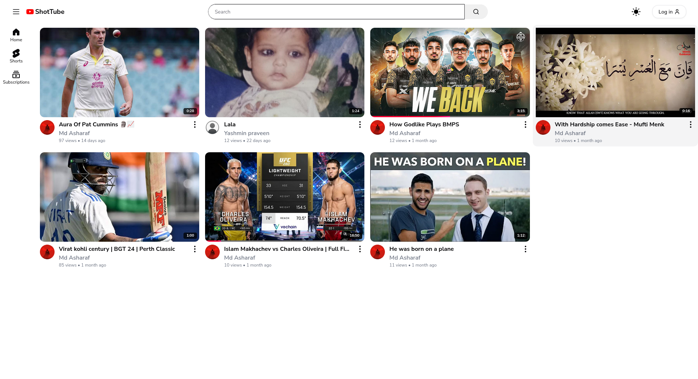

# Shot Tube

## Description

Shot Tube MERN is a full-stack web application built using the MERN (MongoDB, Express, React, Node.js) stack. It allows users to upload and share video content, similar to a mini YouTube application.

## Features

- User authentication and authorization
- Video upload and playback
- HLS streaming with support for multiple resolutions
- Video transcription(English) for enhanced accessibility
- Notification system 
- Commenting,replying and liking system
- Email verification for password reset
- User profile management
- Responsive design

## Installation

To run this project locally, follow these steps:

### Prerequisites

- Node.js
- npm or yarn
- Docker and Docker Compose

### Clone the Repository

```bash
git clone https://github.com/md-asharaf/shot_tube-MERN.git
cd shot_tube-MERN
```

### Using Docker Compose

The project includes a `docker-compose.yml` file for easy setup. Run the following command to start the application using Docker Compose:

```bash
docker-compose up --build
```

This will start the server on port `8000` and the client on port `3000`.

### Install Dependencies (Without Docker)

If you prefer to run the project without Docker, follow these steps:

#### Client

```bash
cd client
yarn install
```

#### Server

```bash
cd server
yarn install
```

### Running the Application (Without Docker)

#### Client

```bash
yarn run dev
```

#### Server

```bash
yarn run dev
```

## Usage

1. Navigate to the `client` directory and start the development server.
2. Navigate to the `server` directory and start the server.
3. Open your browser and visit `http://localhost:3000` to see the application in action.

## Screenshots

### Login Page


### Home Page



## Contributing

Contributions are welcome! Please fork this repository and submit a pull request for any enhancements or bug fixes.

## License

This project is licensed under the ISC License.
